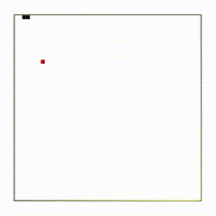

<!--
# Snake Game

    [](https://github.com/salutJuillet/Snake-Game)
-->


<!-- ABOUT THE PROJECT -->
# Snake Game

<div align="center">
    
</div>

This is a simple Snake Game. Feed your snake carefully and check your score!
<br/>


## Built With

[][React-url]
<br/>


<!-- GETTING STARTED -->
## Getting Started

### Installation

1. Clone the repo
   ```sh
   git clone https://github.com/salutJuillet/Snake-Game.git
   ```
2. Install packages using npm
   ```sh
   npm install
   ```
   
   or yarn
   ```sh
   yarn
   ```
<br/>


<!-- How to Play -->
## How To Play

1. Use arrow keys to move around.
2. Eat food and get points.
3. If you hit the walls or your own body, game will be over.
4. Check your score and try again! 
<br/>


<!-- USAGE EXAMPLES -->
<!--
	# Usage

	Use this space to show useful examples of how a project can be used. Additional screenshots, code examples and demos work well in this space. You may also link to more resources.
-->


<!-- CONTRIBUTING -->
## Contributing

Contributions are what make the open source community such an amazing place to learn, inspire, and create. Any contributions you make are **greatly appreciated**.

If you have a suggestion that would make this better, please fork the repo and create a pull request. You can also simply open an issue with the tag "enhancement".
Don't forget to give the project a star! Thanks again!

1. Fork the Project
2. Create your Feature Branch (`git checkout -b feature/AmazingFeature`)
3. Commit your Changes (`git commit -m 'Add some AmazingFeature'`)
4. Push to the Branch (`git push origin feature/AmazingFeature`)
5. Open a Pull Request
<br/>


<!-- CONTACT -->
## Contact

 salut.juilllet@gmail.com


 [https://github.com/salutJuillet](https://github.com/salutJuillet)


<!-- MARKDOWN LINKS & IMAGES -->
<!-- https://www.markdownguide.org/basic-syntax/#reference-style-links -->
[snake-game-preview]: images/preview.gif
[React-url]: https://reactjs.org/
